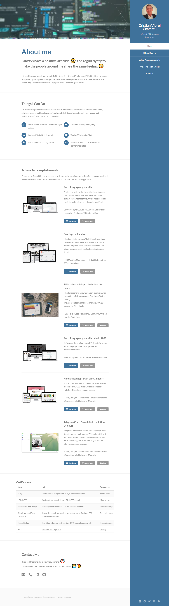

  

# Cristian Viorel Ceamatu - Persona Portofolio

> This is a personal portofolio build on top of the [html5up.net/read-only](https://html5up.net/read-only) template.

## Website screenshot

## Built With

- HTML
- CSS3
- Font awesome icons
- Bootstrap
- Jquery
- Particles js

## Live Demo

[Live Demo Link](http://cristian.adydev.com/)

## To get a local copy up and running follow these simple example steps.

### Setup

Clone the project locally.

Open `index.html` or install and run a live server plugin on you IDE/Text editor.

## Authors

👤 **Cristian Viorel Ceamatu**

- Github: [@githubhandle](https://github.com/cristianCeamatu)
- Twitter: [@twitterhandle](https://twitter.com/CristianCeamatu)
- Linkedin: [linkedin](https://www.linkedin.com/in/ceamatu-cristian/)

## Show your support

Give a ⭐️ if you like this project!

## 📝 License

This project is [MIT](lic.url) licensed.
